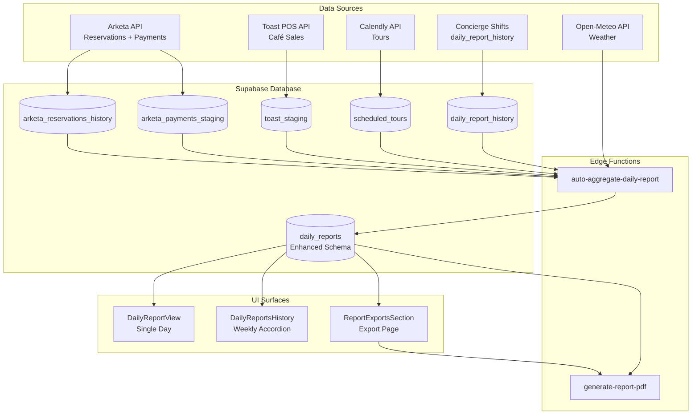

# Manager Report Tool — Build Plan

## Project Overview

We're building a multi-layered daily/weekly reporting tool that:

- **Merges** `daily_reports` and `daily_report_history` tables into one comprehensive schema
- Auto-aggregates data from Arketa, Toast POS, Calendly, weather API, and shift reports
- Provides 3 UI surfaces: Daily Report View, Weekly History, and Report Exports
- Generates PDFs server-side via edge function
- Supports inline editing for all report fields

---

## Architecture Summary




---

## Phase 1: Database Schema Enhancement

### 1.1 Enhance `daily_reports` Table

**Migration file:** `supabase/migrations/YYYYMMDD_enhance_daily_reports_manager_tool.sql`

**Add columns to existing `daily_reports` table:**

```sql
ALTER TABLE daily_reports ADD COLUMN IF NOT EXISTS
  -- Weather
  weather text,
  
  -- Private appointments (from Arketa)
  private_appointments int DEFAULT 0,
  
  -- Arketa sales breakdown
  gross_sales_membership numeric(10,2) DEFAULT 0,
  gross_sales_other numeric(10,2) DEFAULT 0,
  
  -- Feedback (JSONB from daily_report_history, parsed in UI)
  positive_feedback_am jsonb DEFAULT '[]'::jsonb,
  positive_feedback_pm jsonb DEFAULT '[]'::jsonb,
  negative_feedback_am jsonb DEFAULT '[]'::jsonb,
  negative_feedback_pm jsonb DEFAULT '[]'::jsonb,
  
  -- Facility notes
  facility_notes_am jsonb DEFAULT '[]'::jsonb,
  facility_notes_pm jsonb DEFAULT '[]'::jsonb,
  
  -- Crowd/space usage
  crowd_comments_am text,
  crowd_comments_pm text,
  
  -- Tours
  tour_notes text,
  tour_followup_completed boolean DEFAULT false,
  
  -- Cancellations/pauses (from daily_report_history.membership_requests)
  cancellation_notes text,
  
  -- Café notes
  cafe_notes text,
  
  -- Other notes (neutral feedback + management notes)
  other_notes text,
  
  -- Class schedule details (from arketa_reservations_history)
  class_details jsonb DEFAULT '[]'::jsonb,
  
  -- Reservation metrics
  total_cancellations int DEFAULT 0,
  total_no_shows int DEFAULT 0,
  total_waitlisted int DEFAULT 0,
  attendance_rate numeric(5,2),
  class_popularity jsonb DEFAULT '[]'::jsonb,
  instructor_metrics jsonb DEFAULT '{}',
  member_metrics jsonb DEFAULT '{}',
  
  -- Sync tracking
  sync_source text DEFAULT 'auto' CHECK (sync_source IN ('auto', 'manual'));

-- Update existing columns (rename cafe_net_sales → cafe_sales for consistency)
ALTER TABLE daily_reports RENAME COLUMN cafe_net_sales TO cafe_sales;

-- Update calculation: total_sales = gross_sales_arketa + cafe_sales
-- (This will be enforced in edge function and UI)
```

**Key decisions:**

- Keep JSONB for feedback arrays (sentiment-based) — parse in UI layer
- Store facility notes as JSONB arrays (from `daily_report_history.facility_issues`)
- Store class details as JSONB array: `[{time, name, instructor, signups, waitlist}]`
- Keep existing `gross_sales_arketa` column, add membership/other breakdown

### 1.2 Update TypeScript Types

**File:** `[src/integrations/supabase/types.ts](src/integrations/supabase/types.ts)`

After running migration, regenerate types:

```bash
supabase gen types typescript --local > src/integrations/supabase/types.ts
```

---

## Phase 2: Edge Functions — Auto-Aggregation Pipeline

### 2.1 Create `auto-aggregate-daily-report` Edge Function

**File:** `supabase/functions/auto-aggregate-daily-report/index.ts`

**Purpose:** Aggregate all data sources into enhanced `daily_reports` table

**Data flow:**

1. **Arketa Reservations** (from `arketa_reservations_history`)
  - Gym check-ins: `class_name = 'Gym Check In'` AND `checked_in = true`
  - Class check-ins: All other `checked_in = true` (exclude personal/duo training)
  - Private appointments: `class_name ILIKE '%Personal Training%' OR class_name ILIKE '%Duo Training%'`
  - Total reservations: Count all
  - Cancellations: `status = 'cancelled'`
  - No-shows: `status = 'no_show'`
  - Waitlisted: `status = 'waitlisted'`
  - Attendance rate: `checked_in / total_reservations * 100`
2. **Arketa Payments** (from `arketa_payments_staging`)
  - Filter by `created_at_api::date = report_date`
  - Membership sales: `offering_name` contains membership-related strings
  - Other sales: Everything else
  - Convert cents → dollars: `amount / 100`
  - Calculate: `gross_sales_arketa = gross_sales_membership + gross_sales_other`
3. **Toast POS** (from `toast_staging`)
  - Query by `business_date = report_date`
  - Use: `cafe_sales = gross_sales - tax`
  - **Fallback:** If no data in staging, skip (Toast API fallback not in initial build)
4. **Calendly** (from `scheduled_tours`)
  - Filter by `tour_date = report_date` AND `status = 'active'`
  - Extract: `guest_name`, `guest_email`, `start_time`
  - Format: "Guest Name (email) at HH:MM"
5. **Weather** (Open-Meteo API)
  - Call: `https://api.open-meteo.com/v1/forecast?latitude=34.0522&longitude=-118.2437&daily=temperature_2m_max,weathercode&timezone=America/Los_Angeles&start_date={date}&end_date={date}`
  - Parse: Temperature (°F) and condition description
  - Store in `weather` field
6. **Concierge Shifts** (from `daily_report_history`)
  - Query AM shift: `shift_type = 'AM'` AND `report_date = {date}`
  - Query PM shift: `shift_type = 'PM'` AND `report_date = {date}`
  - Extract feedback: Parse `member_feedback` JSONB → filter by sentiment → store in respective JSONB arrays
  - Extract facility notes: Parse `facility_issues` JSONB → store in `facility_notes_am/pm`
  - Extract crowd comments: `busiest_areas` → store in `crowd_comments_am/pm`
  - Extract tour notes: `tour_notes` → merge with Calendly data
  - Extract cancellation notes: `membership_requests` → format as text
  - Extract neutral feedback + management notes: Combine into `other_notes`
7. **Class Schedule** (from `arketa_reservations_history`)
  - Query: All classes for `class_date = report_date`
  - Group by: `class_id`, `class_name`, `start_time`
  - Aggregate: Count signups, instructor name
  - Format: `[{time: "10:00 AM", name: "HIIT", instructor: "Jane", signups: 12, waitlist: 2}]`
  - Store in `class_details` JSONB

**Text merge logic** (for feedback, notes):

```typescript
function mergeTextFields(existing: any[], newItems: any[]): any[] {
  const combined = [...existing, ...newItems];
  const uniqueTexts = new Set(combined.map(item => typeof item === 'string' ? item : item.text));
  return Array.from(uniqueTexts).map(text => ({ text }));
}
```

**Numeric fields:** API data overwrites existing values (no manual edit protection)

**Request body:**

```typescript
{
  date?: string;        // Single date (YYYY-MM-DD)
  start_date?: string;  // For batch processing
  end_date?: string;    // For batch processing
}
```

**Response:**

```json
{
  "success": true,
  "date": "2026-02-16",
  "report": { ...daily_reports_row },
  "data_sources": {
    "arketa_reservations": { count: 45, last_sync: "..." },
    "arketa_payments": { count: 12, total: 1234.56 },
    "toast_staging": { status: "ok" },
    "scheduled_tours": { count: 3 },
    "daily_report_history": { am: true, pm: true },
    "weather": { temp: "72°F", condition: "Clear" }
  }
}
```

### 2.2 Create `generate-report-pdf` Edge Function

**File:** `supabase/functions/generate-report-pdf/index.ts`

**Purpose:** Server-side PDF generation using `jsPDF` (Deno-compatible version)

**Import library:**

```typescript
import jsPDF from "https://esm.sh/jspdf@2.5.2";
```

**Request body:**

```typescript
{
  report_date?: string;      // Single-day PDF
  start_date?: string;       // Weekly PDF
  end_date?: string;         // Weekly PDF
  format: "single" | "weekly" | "batch";
}
```

**PDF Layouts:**

**Single-day (Landscape):**

- Page 1: Two-column DATA/FINANCIALS + NOTES section with AM/PM subsections
- Page 2: CLASS SCHEDULE table

**Weekly (Summary + Details):**

- Page 1: Summary stats + daily breakdown table
- Pages 2-8: Individual day details (simplified landscape)

**Batch (Date range):**

- One page per day (landscape)

**Styling constants:**

```typescript
const COLORS = {
  headerDark: [50, 50, 50],
  headerMedium: [90, 85, 80],
  valueBox: [230, 230, 225],
  subsection: [210, 205, 200],
};
const FONT = "Helvetica";
```

**Response:** Binary PDF file with appropriate headers:

```typescript
return new Response(pdfBytes, {
  headers: {
    'Content-Type': 'application/pdf',
    'Content-Disposition': `attachment; filename="Daily-Report-${date}.pdf"`,
  },
});
```

### 2.3 Update `sync_schedule` Table

**Migration:** Add entries for new auto-aggregation

```sql
INSERT INTO sync_schedule (sync_name, sync_function, frequency_minutes, is_enabled)
VALUES
  ('daily_report_aggregation', 'auto-aggregate-daily-report', 60, true),
  ('weather_sync', 'auto-aggregate-daily-report', 1440, true); -- Once daily
```

**Note:** `scheduled-sync-runner` will call `auto-aggregate-daily-report` hourly

---

## Phase 3: UI Components

### 3.1 Create Two New Pages

**New routes in `[src/App.tsx](src/App.tsx)`:**

```typescript
// Add after existing /dashboard/reports route
<Route
  path="/dashboard/daily-reports"
  element={
    <ProtectedRoute requiredRoles={["admin", "manager"]}>
      <DailyReportsPage />
    </ProtectedRoute>
  }
/>
<Route
  path="/dashboard/report-exports"
  element={
    <ProtectedRoute requiredRoles={["admin", "manager"]}>
      <ReportExportsPage />
    </ProtectedRoute>
  }
/>
```

**Update navigation in `[src/components/layout/DashboardLayout.tsx](src/components/layout/DashboardLayout.tsx)`:**

Add to `managerToolsItems` (around line 158):

```typescript
{
  title: "Daily Reports",
  url: "/dashboard/daily-reports",
  icon: FileText
},
{
  title: "Report Exports",
  url: "/dashboard/report-exports",
  icon: Download
},
```

### 3.2 Daily Reports Page (`DailyReportsPage.tsx`)

**File:** `src/pages/dashboards/DailyReportsPage.tsx`

**Features:**

- Tab 1: **Single Day View** — Date picker + report display with edit toggle
- Tab 2: **Weekly History** — Week navigator (Tuesday-Monday) + accordion with daily reports

**Components:**

- `<DailyReportView />` — Single-day report with inline editing
- `<DailyReportsHistory />` — Weekly accordion view

**Data hooks:**

```typescript
const { data: report, isLoading } = useQuery({
  queryKey: ['daily-report', date],
  queryFn: () => supabase
    .from('daily_reports')
    .select('*')
    .eq('report_date', date)
    .single()
});

const updateReport = useMutation({
  mutationFn: (updates) => supabase
    .from('daily_reports')
    .update(updates)
    .eq('report_date', date),
  onSuccess: () => queryClient.invalidateQueries(['daily-report', date])
});
```

**Edit mode:**

- Toggle button: "Edit" ↔ "Save" / "Cancel"
- Inline `<Input>` for numeric fields
- `<Textarea>` for text fields (feedback, notes)
- Auto-calculate on save:
  ```typescript
  const recalculateSales = () => ({
    gross_sales_arketa: formData.gross_sales_membership + formData.gross_sales_other,
    total_sales: formData.gross_sales_arketa + formData.cafe_sales
  });
  ```

**Export button:** Downloads PDF by calling edge function

**Delete report:** Soft delete or hard delete (confirm dialog)

### 3.3 Report Exports Page (`ReportExportsPage.tsx`)

**File:** `src/pages/dashboards/ReportExportsPage.tsx`

**Features:**

1. **Single-Day Export**
  - Date picker
  - "Preview" button → Opens `<ReportPreviewDialog>`
  - "Export PDF" button → Downloads from edge function
2. **Weekly Export**
  - Week picker (Tuesday-Monday)
  - "Preview" button → Opens `<ReportPreviewDialog>` with tabs for each day
  - "Export PDF" button → Downloads multi-page PDF
3. **API Sync Status**
  - Dropdown showing per-source sync timestamps
  - Status icons: ✓ (synced < 1hr), ⚠️ (synced 1-6hr), ✗ (6hr+)
  - Data pulled from `last_synced_at` fields
4. **Auto-refresh**
  - On date/week change, call `auto-aggregate-daily-report` edge function
  - Show loading spinner while aggregating

**Preview Dialog Component:**

```typescript
<ReportPreviewDialog
  reportDate={selectedDate}
  onExport={() => downloadPDF(selectedDate)}
  tabs={["Preview", "Edit"]}
/>
```

**Preview tab:** Read-only display matching PDF layout

**Edit tab:** Same inline editing as `DailyReportView`

### 3.4 Shared Components

**Create:** `src/components/reports/`

- `ReportPreviewDialog.tsx` — Modal with preview/edit tabs
- `ReportDataSection.tsx` — Data/Financials two-column layout
- `ReportNotesSection.tsx` — Notes section with AM/PM subsections
- `ClassScheduleTable.tsx` — Class schedule table component
- `WeeklySummaryCard.tsx` — Summary stats card for weekly view
- `SyncStatusIndicator.tsx` — API sync status display

**Reusable hooks:**

- `useReport(date)` — Fetch single report
- `useWeeklyReports(startDate, endDate)` — Fetch weekly reports
- `useAggregateReport(date)` — Trigger auto-aggregation
- `useExportPDF(date, format)` — Download PDF

**File:** `src/hooks/useReports.ts`

---

## Phase 4: PDF Generation Details

### 4.1 Single-Day PDF Layout

**Page 1 (Landscape, 11×8.5"):**

```
┌────────────────────────────────────────────────────────────────┐
│  HU+E                 Daily Report                  02/16/2026 │
├────────────────────────────────────────────────────────────────┤
│                                                                │
│  ┌─────────────────────────────┬──────────────────────────┐   │
│  │ DATA                        │ FINANCIALS               │   │
│  ├─────────────────────────────┼──────────────────────────┤   │
│  │ Weather: 72°F Clear         │ Gross Sales - Membership │   │
│  │ Total Gym Check-Ins: 45     │ $1,234.56                │   │
│  │ Total Class Check-Ins: 23   │ Gross Sales - Other      │   │
│  │ Private Appointments: 5     │ $567.89                  │   │
│  │                             │ Café Sales: $890.12      │   │
│  │                             │ Total Sales: $2,692.57   │   │
│  └─────────────────────────────┴──────────────────────────┘   │
│                                                                │
│  ┌───────────────────────────────────────────────────────┐    │
│  │ NOTES                                                 │    │
│  ├────────────────────────────┬──────────────────────────┤    │
│  │ Positive Feedback (AM/PM)  │ Negative Feedback (AM/PM)│    │
│  │ - Member loved new class   │ - WiFi down 2-3pm        │    │
│  ├────────────────────────────┼──────────────────────────┤    │
│  │ Facility Notes (AM/PM)     │ Crowd/Space Usage (AM/PM)│    │
│  │ - Bathroom light out       │ - Busiest 6-8am, 5-7pm   │    │
│  ├────────────────────────────┼──────────────────────────┤    │
│  │ Tour Notes                 │ Cancellation Notes       │    │
│  │ - Jane Doe (jane@...)      │ - [CANCEL] John Smith... │    │
│  ├────────────────────────────┴──────────────────────────┤    │
│  │ Notes for Management                                  │    │
│  │ - Neutral feedback and other notes here               │    │
│  └───────────────────────────────────────────────────────┘    │
└────────────────────────────────────────────────────────────────┘
```

**Page 2 (Class Schedule):**

```
┌────────────────────────────────────────────────────────────────┐
│                      CLASS SCHEDULE                            │
├────────┬──────────┬──────────────────────┬────────────────────┤
│ Time   │ Sign-ups │ Instructor           │ Class Name         │
├────────┼──────────┼──────────────────────┼────────────────────┤
│ 6:00   │ 12       │ Jane Smith           │ Morning HIIT       │
│ 10:00  │ 8        │ Bob Jones            │ Yoga Flow          │
│ ...    │ ...      │ ...                  │ ...                │
└────────┴──────────┴──────────────────────┴────────────────────┘
```

### 4.2 Weekly PDF Layout

**Page 1 (Summary):**

- Header: "Weekly Report Summary — Feb 10-16, 2026"
- Summary stats: Total gym/class check-ins, appointments, sales
- Daily breakdown table: 7 rows (one per day)

**Pages 2-8 (Individual days):**

- Same layout as single-day PDF (simplified, no class schedule)

---

## Phase 5: Integration & Testing

### 5.1 Manual Testing Checklist

1. **Aggregation:**
  - Call `auto-aggregate-daily-report` for a date with existing data
  - Verify all fields populated correctly
  - Check feedback sentiment parsing
  - Verify class schedule JSONB structure
2. **UI — Daily Report View:**
  - Load report for today
  - Toggle edit mode
  - Edit numeric fields → verify auto-calculation
  - Edit text fields → save → verify persistence
  - Export PDF → verify layout
3. **UI — Weekly History:**
  - Navigate to previous week (Tuesday start)
  - Expand accordion → verify report display
  - Edit within accordion → save → verify
4. **UI — Report Exports:**
  - Select date → Preview → verify modal
  - Export single-day PDF → verify download
  - Select week → Export weekly PDF → verify summary + details
  - Check sync status indicator
5. **PDF Generation:**
  - Single-day landscape → verify layout
  - Weekly summary → verify table
  - Class schedule table → verify sorting by time

### 5.2 Edge Cases

- **Missing data:** Show "No data" placeholders in UI and PDF
- **Empty JSONB arrays:** Render as empty sections (no errors)
- **Long text fields:** Truncate in PDF with "..." if exceeds space
- **Toast staging empty:** Skip café sales (show $0.00)
- **No shift reports:** Show "No concierge reports submitted"

---

## File Structure Summary

### Database

- `supabase/migrations/YYYYMMDD_enhance_daily_reports_manager_tool.sql`

### Edge Functions

- `supabase/functions/auto-aggregate-daily-report/index.ts`
- `supabase/functions/generate-report-pdf/index.ts`

### Frontend — Pages

- `src/pages/dashboards/DailyReportsPage.tsx` (new)
- `src/pages/dashboards/ReportExportsPage.tsx` (new)

### Frontend — Components

- `src/components/reports/DailyReportView.tsx`
- `src/components/reports/DailyReportsHistory.tsx`
- `src/components/reports/ReportPreviewDialog.tsx`
- `src/components/reports/ReportDataSection.tsx`
- `src/components/reports/ReportNotesSection.tsx`
- `src/components/reports/ClassScheduleTable.tsx`
- `src/components/reports/WeeklySummaryCard.tsx`
- `src/components/reports/SyncStatusIndicator.tsx`

### Frontend — Hooks

- `src/hooks/useReports.ts`

### Modified Files

- `[src/App.tsx](src/App.tsx)` — Add routes
- `[src/components/layout/DashboardLayout.tsx](src/components/layout/DashboardLayout.tsx)` — Add nav items
- `[src/integrations/supabase/types.ts](src/integrations/supabase/types.ts)` — Regenerate after migration

---

## Implementation Notes

### Key Technical Decisions

1. **Merge tables:** Enhanced `daily_reports` becomes single source of truth
2. **JSONB for feedback:** Keep sentiment-based structure, parse in UI
3. **Server-side PDF:** Edge function using jsPDF for security and performance
4. **Tuesday-Monday weeks:** Use `date-fns` `startOfWeek(date, {weekStartsOn: 2})`
5. **Auto-calculate sales:** Always recalculate on save to prevent drift
6. **Text merge deduplication:** Use `Set` to eliminate exact duplicate lines
7. **Numeric fields overwrite:** API data is source of truth (no manual protection)

### Dependencies

**No new npm packages needed** — all existing:

- `date-fns` (already installed)
- `@tanstack/react-query` (already installed)
- `@supabase/supabase-js` (already installed)
- `lucide-react` (icons)
- Radix UI components (already installed)

**Edge function dependency:**

- `jsPDF` from `https://esm.sh/jspdf@2.5.2` (Deno import)

### RLS Policies

Daily reports already have RLS policies:

- Managers can manage all reports
- Concierges can view reports

**No changes needed** — existing policies cover new fields.

---

## Success Criteria

✅ **Aggregation pipeline works:**

- All 5 data sources populate correctly
- Text merge deduplication works
- Feedback sentiment parsing accurate

✅ **UI is functional:**

- Date/week navigation smooth
- Inline editing saves correctly
- Auto-calculation works

✅ **PDF export works:**

- Single-day landscape PDF matches spec
- Weekly summary + details correct
- Class schedule sorts by time

✅ **Performance acceptable:**

- Aggregation completes in < 10s
- PDF generation completes in < 5s
- UI loads in < 2s

---

## Future Enhancements (Out of Scope)

- Toast API fallback logic
- AI sentiment analysis for feedback
- Email delivery of PDFs
- Scheduled PDF generation (e.g., email daily report at 11pm)
- Historical trend charts
- Custom date range batch export with progress bar

