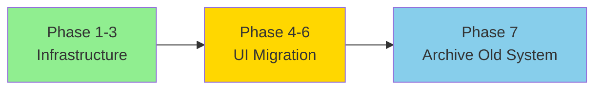

# Migration Strategy - Safe Deprecation Approach

## Bug Fix Applied ✅

**Issue:** Original migration added CHECK constraints that would immediately break policy creation.

**Solution:** Modified migration to use gradual deprecation approach.

## Safe Migration Phases

### Phase 1-3: Infrastructure Only (Current)
**Status:** ✅ Safe to apply

- Add PDF text search support
- Add page-specific flagging columns
- Add tracking columns to old tables
- Create "Policies" folder
- **DO NOT** archive existing policies
- **DO NOT** add CHECK constraints

**Result:** Both systems work in parallel. No breaking changes.

### Phase 4-6: UI Migration (In Progress)
**Status:** ⏳ In development

- Build new Policy Documents Manager
- Update staff views to show PDFs
- Keep old policies visible during transition
- Gradual migration of content

**Result:** Old policies still visible, new PDF system available.

### Phase 7: Final Deprecation (After UI Complete)
**Status:** ⏳ Future

Once ALL UI is migrated and tested:

```sql
-- Step 1: Archive all remaining policies
UPDATE public.club_policies 
SET archived_at = now(), is_active = false
WHERE archived_at IS NULL;

UPDATE public.policy_categories 
SET archived_at = now(), is_active = false
WHERE archived_at IS NULL;

-- Step 2: Add constraints to prevent new inserts
ALTER TABLE public.club_policies 
  ADD CONSTRAINT no_new_policies_use_resource_pages 
  CHECK (archived_at IS NOT NULL);

ALTER TABLE public.policy_categories 
  ADD CONSTRAINT no_new_categories_use_resource_folders 
  CHECK (archived_at IS NOT NULL);
```

## Migration Timeline



### Current State (Phase 3)
- ✅ PDF infrastructure ready
- ✅ Text extraction working
- ✅ Page flagging ready
- ✅ Old system still functional
- ✅ Both systems can coexist

### Next State (Phase 4-6)
- ⏳ Build new UI
- ⏳ Gradually upload PDFs
- ⏳ Both systems visible
- ⏳ Staff use both as needed

### Final State (Phase 7)
- ⏳ All content in PDFs
- ⏳ Archive old policies
- ⏳ Add constraints
- ⏳ Remove old UI

## Why This Approach?

### Problems with Immediate Deprecation
❌ Breaks existing functionality
❌ Forces all-or-nothing cutover
❌ No testing period
❌ Cannot rollback easily
❌ Staff lose access to policies during migration

### Benefits of Gradual Approach
✅ Both systems work during transition
✅ Can test new system thoroughly
✅ Easy rollback at any point
✅ No service interruption
✅ Migrate content at comfortable pace
✅ Staff always have access to policies

## Current Migration Status

### What's Safe to Apply Now

```bash
# These migrations are safe and non-breaking:
supabase/migrations/20260224000000_add_pdf_text_search.sql ✅
supabase/migrations/20260224000001_add_page_specific_flags.sql ✅
supabase/migrations/20260224000002_deprecate_policies_system.sql ✅ (fixed)
```

### What They Do

1. **20260224000000** - Adds PDF text search (enhances existing feature)
2. **20260224000001** - Adds page flagging columns (new feature, no breaking changes)
3. **20260224000002** - Adds tracking columns and "Policies" folder (no breaking changes)

### What They DON'T Do

- ❌ Don't archive existing policies
- ❌ Don't add breaking constraints
- ❌ Don't remove any functionality
- ❌ Don't change existing data (except creating folder)

## Testing Strategy

### After Applying Migrations

1. **Verify old system still works:**
   ```
   - Create new policy ✅
   - Edit policy ✅
   - Delete policy ✅
   - View policies ✅
   ```

2. **Verify new infrastructure ready:**
   ```
   - "Policies" folder exists ✅
   - Can upload PDF to Policies folder ✅
   - Text extraction works ✅
   - Page flagging columns exist ✅
   ```

3. **Verify coexistence:**
   ```
   - Old policies visible ✅
   - New PDFs visible ✅
   - Search finds both ✅
   - No conflicts ✅
   ```

## Rollback Procedures

### If Issues Found After Migration

**Immediate Rollback (seconds):**
```sql
-- Just revert the migration files
-- Nothing breaks since we didn't add constraints
```

**Partial Rollback (minutes):**
```sql
-- Keep new features, remove "Policies" folder if needed
DELETE FROM resource_page_folders WHERE name = 'Policies';
```

**Full Rollback (minutes):**
```bash
# Revert all three migrations
supabase db reset --version PREVIOUS_VERSION
```

## Deployment Checklist

### Before Applying Migrations

- [ ] Backup database
- [ ] Test migrations in dev environment
- [ ] Verify old policy creation still works after migration
- [ ] Verify "Policies" folder created
- [ ] Document rollback plan

### After Applying Migrations

- [ ] Verify old policies visible in UI
- [ ] Test creating new policy (should work)
- [ ] Test editing policy (should work)
- [ ] Upload test PDF to Policies folder
- [ ] Verify text extraction works
- [ ] Test page flagging (flag a page in PDF)

### Before Phase 7 (Final Deprecation)

- [ ] All policies migrated to PDFs
- [ ] Old UI completely removed
- [ ] New UI fully tested
- [ ] Staff trained on new system
- [ ] Backup old policy data
- [ ] Then run archive + constraint SQL

## Communication Plan

### For Development Team

"We're adding PDF infrastructure without breaking existing policies. The old system keeps working while we build the new one. No service interruption."

### For Managers

"We're preparing to replace policies with PDFs. You'll still use the current system until we notify you. No changes to your workflow yet."

### For Staff

"No changes yet. Policies work exactly as before. Watch for announcements about the new PDF-based policy system coming soon."

## Summary

### Before Fix ❌
- CHECK constraints added immediately
- Policy creation breaks
- Application unusable
- Forced cutover

### After Fix ✅
- No breaking constraints
- Policy creation works
- Application stable
- Gradual migration
- Both systems coexist safely

---

## Migration Files Status

✅ **20260224000000_add_pdf_text_search.sql** - Safe
✅ **20260224000001_add_page_specific_flags.sql** - Safe
✅ **20260224000002_deprecate_policies_system.sql** - Fixed, now safe

All migrations ready to apply without breaking the application!
