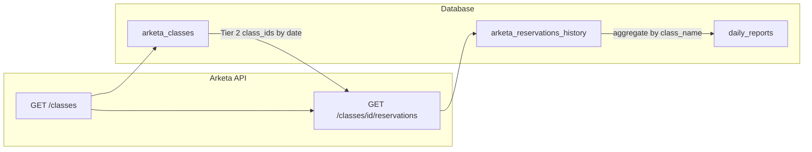

# Arketa API and Tables Architecture

This document is the single source of truth for how the Arketa API, sync functions, and hume-ops tables work together. See also [supabase/README_BACKFILL_ALIGNMENT.md](../supabase/README_BACKFILL_ALIGNMENT.md) for backfill deployment and staging → history flow.

## API shape

The Arketa API does **not** expose a standalone reservations endpoint that returns all reservations by date. Reservations are nested under classes:

- **GET /classes?start_date=X&end_date=Y** — Returns a list of class objects (paginated).
- **GET /classes/{class_id}/reservations?limit=500** — Returns reservations for **one** class.

You cannot get reservations without first knowing which classes exist. The **arketa_classes** table is the index/catalog that tells the system which `class_id` values to query for reservations.

Optional Tier 1 endpoints (often 0 or 404): `/reservations?start_date=&end_date=`, `/bookings`, `/schedule/reservations`. These are tried first when implementing the 3-tier strategy but are unreliable.

## 3-tier fetch strategy

The `sync-arketa-reservations` function uses a cascading fallback:

| Tier | Method | When used |
|------|--------|-----------|
| **Tier 1** | Direct `/reservations?start_date=&end_date=`, then `/bookings`, `/schedule/reservations` | Tried first (historical dates). If returns data → use it and skip other tiers. Often returns 0 or 404. |
| **Tier 2** | Database-driven: query **arketa_reservations_history** for distinct `class_id` in the date range, then for each call GET /classes/{id}/reservations | If Tier 1 empty. Relies on previously synced data. If no prior data for those dates → falls through. |
| **Tier 3** | Classes-based: GET /classes?start_date=&end_date= (paginated), then for each class GET /classes/{class_id}/reservations | Primary fallback. Only method guaranteed to discover all classes for the range. |

## Why arketa_classes is critical

- **Master catalog** of all class instances (including cancelled), with `class_date` for date-range lookups.
- **Tier 2** uses `arketa_reservations_history` to get `class_id`s; the backfill UI can cross-reference **arketa_classes** vs **arketa_reservations_history** for “orphaned” classes (in catalog but zero reservation records).
- **total_booked** (stored as `booked_count` in the table) allows the system to detect when fetched reservations are suspiciously low (e.g. “Gym Check In” missed).
- **class_name** is used to classify gym vs class attendance for daily_reports aggregation.

Classes are synced by **sync-arketa-classes** (date range) or **backfill-historical** (per-date `syncArketaClasses`). A full historical backfill of every class ever created (including cancelled) populates this catalog.

## Why classes can be “missed”

- **/classes filters** — If you don’t pass `include_cancelled=true`, `include_past=true`, `include_completed=true`, cancelled or completed classes are omitted and their reservations are invisible.
- **Pagination** — High-volume days can have hundreds of classes. If pagination breaks (cursor loops, timeouts), some classes are never fetched.
- **“Gym Check In”** — A virtual class with 300+ reservations per day. If this single `class_id` is missed, the day’s gym check-in count is zero. This class gets a **new class_id every day**; it must be discovered via /classes each time, not hardcoded.

## Table overlap map

```
arketa_classes                    arketa_reservations_history
+----------------+                 +-------------------------+
| external_id   | ----<used by>--->| class_id (FK concept)   |
| name          |                  | class_name (denorm)     |
| class_date    |                  | class_date              |
| start_time    |                  | reservation_id (PK)    |
| instructor_   |                  | client_id               |
|   name        |                  | status, checked_in      |
| booked_count |                  | gross_amount_paid       |
| is_cancelled  |                  +-------------------------+
+----------------+                            |
       |                                      |
       | (class_name match)                   | (client_id FK)
       v                                      v
daily_reports                        arketa_clients
+------------------+                 +----------------+
| report_date      |                 | client_id (PK) |
| total_gym_       |                 | client_name    |
|   checkins       |                 | lifecycle_stage|
| total_class_     |                 +----------------+
|   checkins       |                          |
| gross_sales_     |                          | (client_id FK)
|   arketa         |                          v
+------------------+                 arketa_subscriptions
                                     arketa_payments_history
```

- **arketa_classes** also links to: arketa_instructors (via instructor_id in raw_data; instructor_name denormalized), arketa_services (via service_id in raw_data), arketa_waitlists (via class_id).

## Aggregation chain

Reservations flow into **daily_reports** via aggregation:

1. **Source:** `arketa_reservations_history` with `checked_in = true` and `class_date = report_date`.
2. **Classification:** For each row, `class_name` is used:
   - If `(class_name || '').toLowerCase() === 'gym check in'` → count as **gym** → `daily_reports.total_gym_checkins`.
   - Else → count as **class** → `daily_reports.total_class_checkins`.
3. **Target:** Upsert `daily_reports` (report_date, total_gym_checkins, total_class_checkins). Optionally refresh gross_sales_arketa.

This is why **class_name** is denormalized into `arketa_reservations_history` — aggregation does not need to join back to arketa_classes.

## Partner API classes endpoint (official notes)

From the Arketa API engineering team:

- **Pagination:** Use the **full** value from the response as `start_after` for the next page. Example: `"nextStartAfterId": "classes%2FP8k22mPi6hc05KP25sCM"` — send that entire string (including `classes%2F` and the encoded slash). Using only the class ID (e.g. `P8k22mPi6hc05KP25sCM`) will not work.
- **Page size:** Maximum `limit` is 100. Sending `limit=500` still returns 100 per page; paginate with `start_after` to get more.
- **Date range:** Use `start_date` and `end_date` query parameters (e.g. `start_date=2026-01-20`, `end_date=2026-04-17`).

**How we implement it:**

- **sync-arketa-classes** caps `limit` at 100, sends `start_date`/`end_date` on every request, and uses the API’s `nextStartAfterId` as-is for `start_after` on the next request (no stripping to class ID). The only constructed cursor is in Strategy B (skip-ahead), where we build `classes/<external_id>` so the slash is encoded by the URL layer.
- **Backfill:** `run-backfill-job` stores the sync response’s `nextStartAfterId` in `backfill_jobs.batch_cursor` and passes it as `start_after_id` on the next batch. The full value is never replaced with a DB-derived class ID (see comment in `run-backfill-job`: “Partner API requires the full nextStartAfterId value”).

**How to verify the cursor is the full value:**

- **Supabase logs:** In Edge Function logs for `sync-arketa-classes` or `run-backfill-job`, look for `start_after_id=` or `start_after=`. If the value contains `classes` or `%2F`, it’s the full cursor.
- **Database:** After a backfill batch that has more pages, run:  
  `SELECT id, job_type, batch_cursor, total_batches_completed FROM backfill_jobs WHERE job_type IN ('arketa_classes','arketa_classes_and_reservations') ORDER BY created_at DESC LIMIT 5;`  
  If `batch_cursor` looks like `classes%2FP8k22mPi6hc05KP25sCM` (or similar), the full value is being stored and passed.

## Summary: why each table matters

| Table | Role | What breaks without it |
|-------|------|------------------------|
| arketa_classes | Master catalog of all class instances | Tier 2/orphan detection impossible; no capacity/booking metadata; Tier 3 can’t be supplemented by DB-driven fetch |
| arketa_reservations_history | Individual attendance records | No check-in data, no daily aggregations, no client visit tracking |
| arketa_clients | Member identity | Can’t link reservations to people; no lifecycle stage |
| arketa_subscriptions | Membership status | Can’t determine active/cancelled/paused |
| arketa_payments_history | Financial transactions | No revenue per client or per day |
| arketa_instructors | Teacher identity | Can’t match instructors to Sling staff schedules |
| daily_reports | Aggregated daily metrics | Management dashboards have no data |

## Diagram


